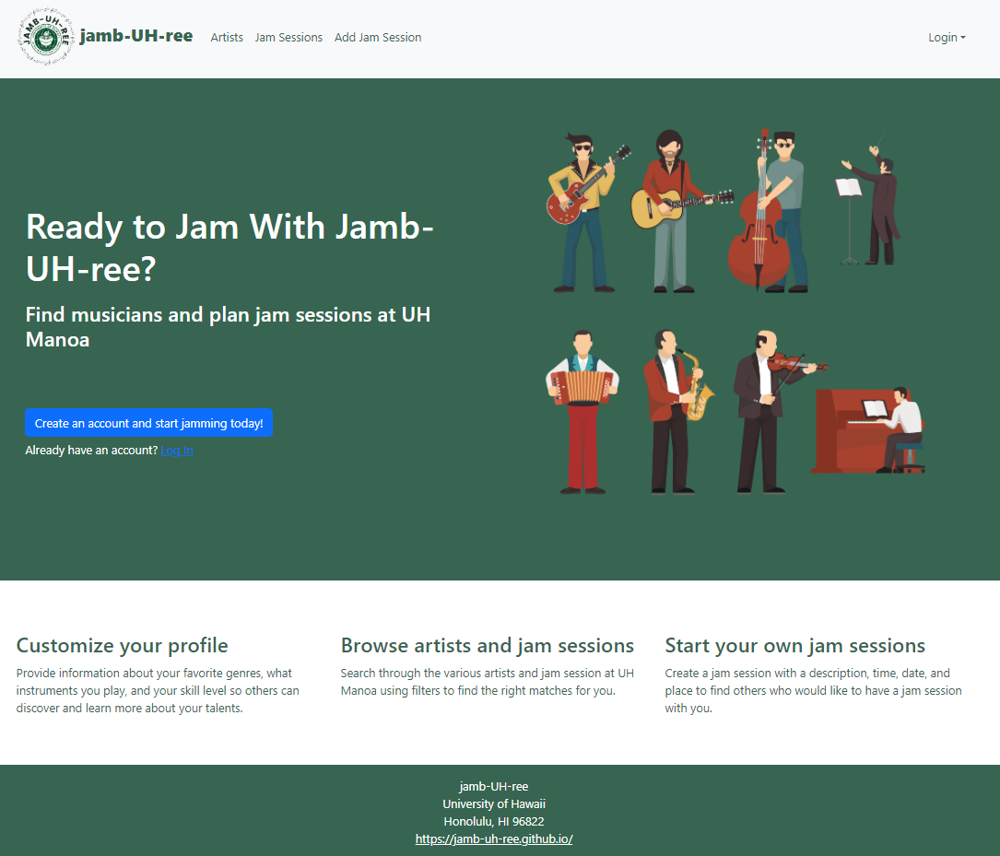
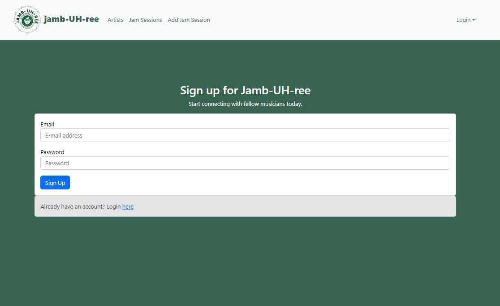
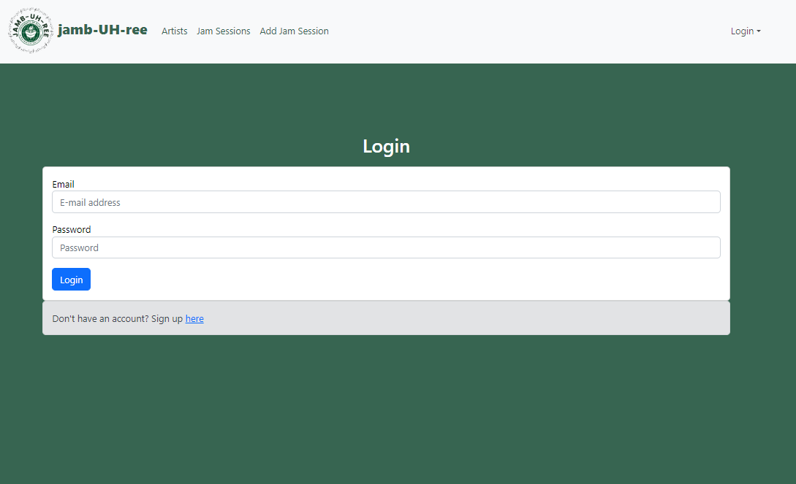
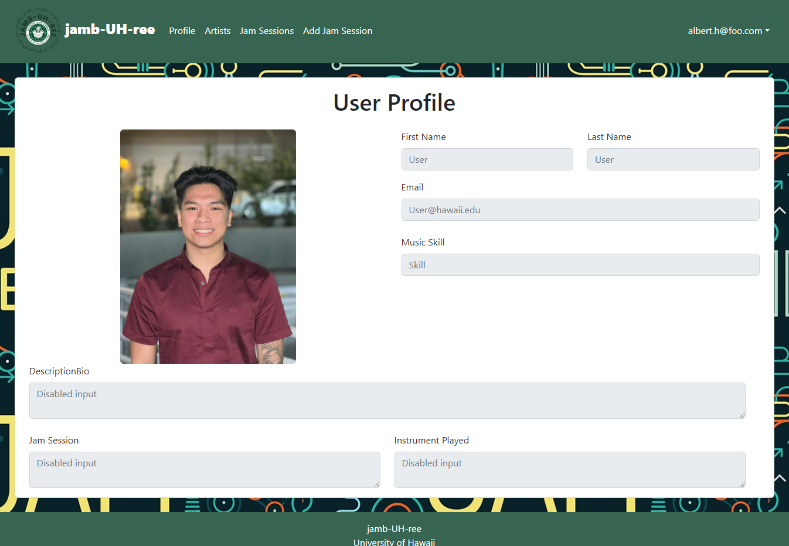
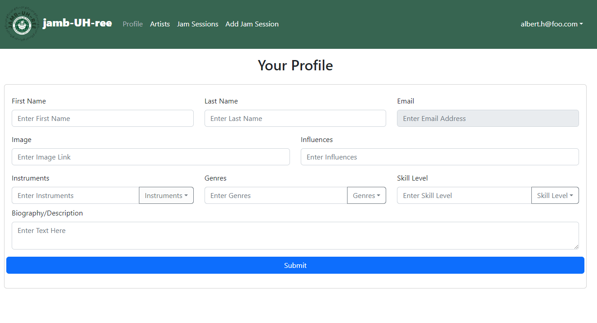
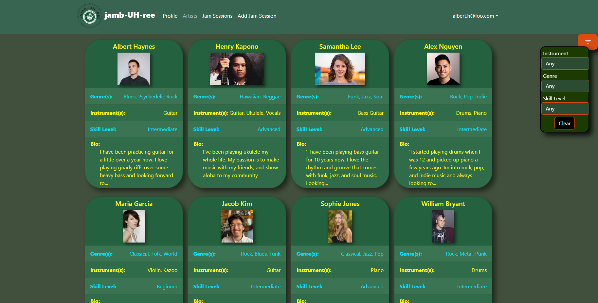
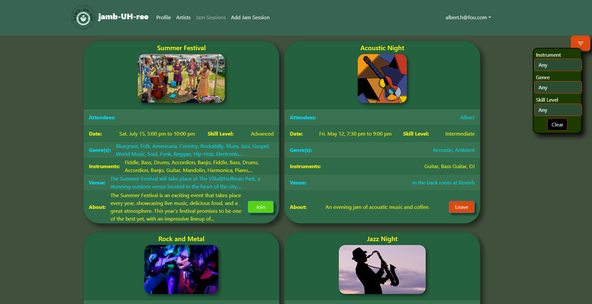

# Jamb-UH-ree

## Table of contents

* [Overview](#overview)
* [Current State](#current-state)
* [Deployment](#deployment)
* [Progress](#progress)
* [Team](#team)

## Overview

Jamb-UH-ree is a hub for students at UH Manoa to find and connect with each other in order to plan jam sessions. The Jamb-UH-ree organization's GitHub can be viewed <a href="https://github.com/jamb-uh-ree">here</a>.

## Current State

This section provides the current state of the Jamb-UH-ree user interface and its capabilities.

### Landing

The landing page is the first page presented to users who are not logged into an account. Here users can choose to make an account, log in, and learn more about Jamb-UH-ree.

### Sign Up

This is where users can input their email and password to create a Jamb-UH-ree account.

### Sign In

This is where users can input their email and password to log into a Jamb-UH-ree account.

### Profile Page

This is an example of a profile page of Elis Diep.

### Edit Profile

This is where users can personalize and add more information to their profile.

### Browse Artists Page

In the artist browse page, users can look and filter through the list of other users to find people to jam with.

### Browse Jam Sessions Page

In the jam session browse page, users can look and filter through the list of ongoing and future jam sessions to learn more about the sessions and choose to join.

### Create Jam Session

The create jam session page allows users to create a jam session so others will be able to see and join the session.

## Deployment

This project has been deployed to Digital Ocean and can be found <a href="http://165.232.106.39/">here</a>.

## Progress

You can view the team's progress of the first milestone <a href="https://github.com/orgs/jamb-uh-ree/projects/1/views/1?layout=board">here</a>. The main goal for this milestone was to create the majority of the user interface.

You can view the team's progress of the second milestone <a href="https://github.com/orgs/jamb-uh-ree/projects/3/views/1?layout=board">here</a>. The goal for the second milestone is to implement more of the database and functionality of the website.

## Team

Jamb-UH-ree is designed, implemented, and maintained by [Jaeden Chang](https://jaedench.github.io/), [Elis Diep](https://elisdiep.github.io/), [Reid Lum](https://reidlum.github.io/), and [Caleb Mueller](https://calebmueller-uh.github.io/). These members have signed a contract for this organization which can viewed <a href="https://docs.google.com/document/d/1RjHlU3JCVSA35spR8NsnANxm8wTX9YFo0xGyXEpNkgY/edit?usp=sharing">here</a>.
