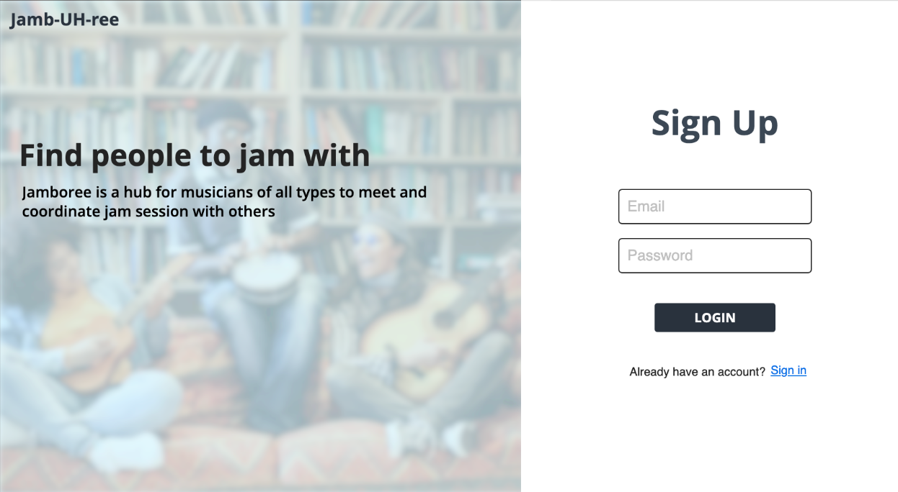
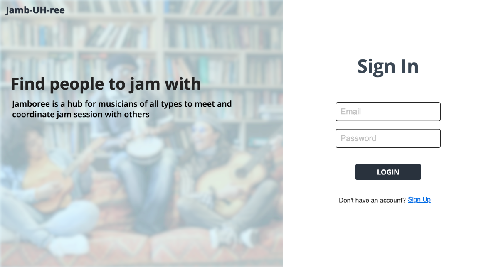
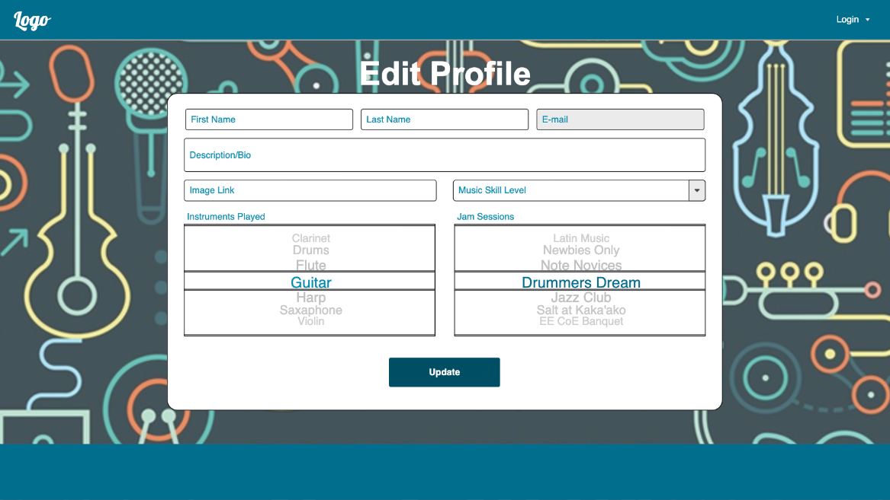
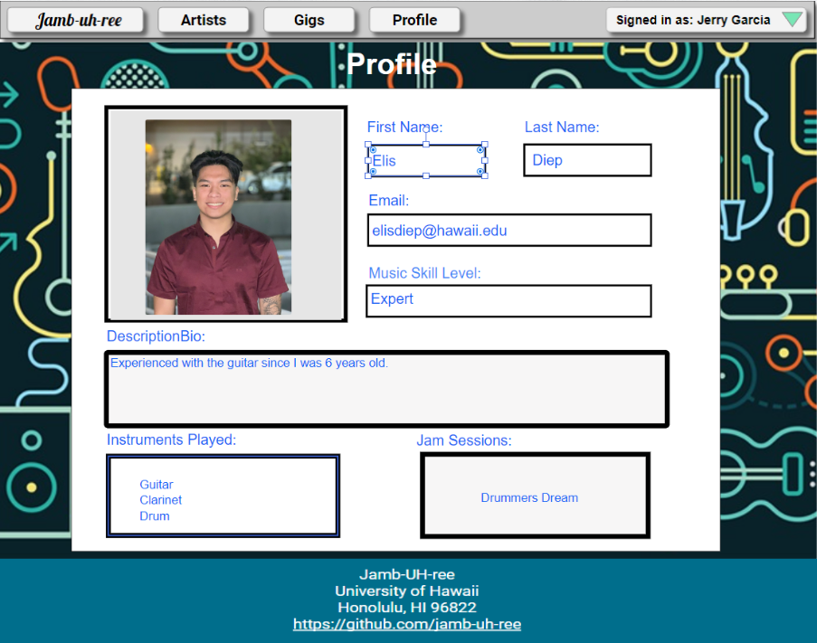
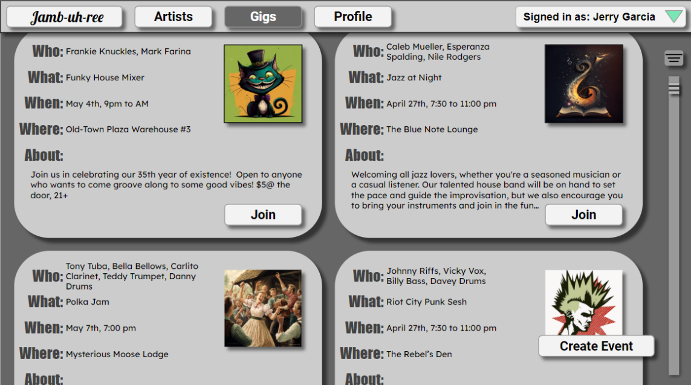
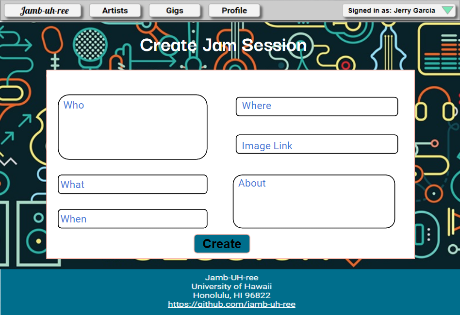

# Jamb-UH-ree

## Table of contents

* [Overview](#overview)
* [Future Plans](#future-plans)
* [Mock Ups](#mock-ups)
* [Deployment](#deployment)

## Overview

Jamb-UH-ree is a hub for students at UH Manoa to find and connect with each other in order to plan jam sessions. The Jamb-UH-ree organization's GitHub can be viewed <a href="https://github.com/jamb-uh-ree">here</a>.

## Future Plans

The Jamb-UH-ree application will allow users to make an account, add information to that account, and browse/filter through a list of other accounts to find others that would like to participate in a jam session.

## Mock Ups

This section provides a mock up of the Jamb-UH-ree user interface and its capabilities.

### Sign Up

The sign up is presented to users when they visit the site. Users can choose to sign up by inputting an email address and creating a password, or choose to sign in if they already have an account.

### Sign in

This is where users can input their email and password to log into their Jamb-UH-ree account.

### Edit Profile

This is where users can personalize and add more information to their profile.

### Profile Page

This is an example of a profile page of Elis Diep.

### Browse Artists Page

In the artist browse page, users can look through the list of other users to find people to jam with.

### Browse Jam Sessions Page

In the jam session browse page, users can look through the list of ongoing and future jam sessions to learn more about the sessions and choose to join.

### Create Jam Session

The create jam session page allows users to create a jam session so others will be able to see and join the session.

## Deployment

This project will be deployed to Digital Ocean soon.

## Progress

You can view the team's progress of the first milestone <a href="https://github.com/orgs/jamb-uh-ree/projects/1/views/1?layout=board">here</a>.

## Team

Jamb-UH-ree is designed, implemented, and maintained by [Jaeden Chang](https://jaedench.github.io/), [Elis Diep](https://elisdiep.github.io/), [Reid Lum](https://reidlum.github.io/), and [Caleb Mueller](https://calebmueller-uh.github.io/). These members have signed a contract for this organization which can viewed <a href="https://docs.google.com/document/d/1RjHlU3JCVSA35spR8NsnANxm8wTX9YFo0xGyXEpNkgY/edit?usp=sharing">here</a>.
