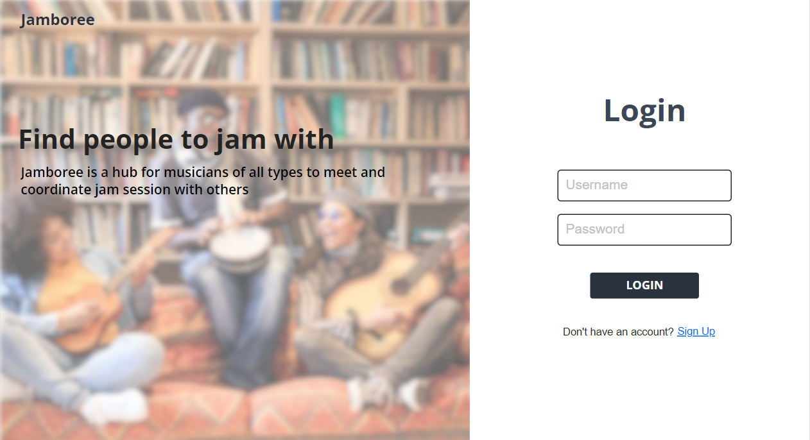
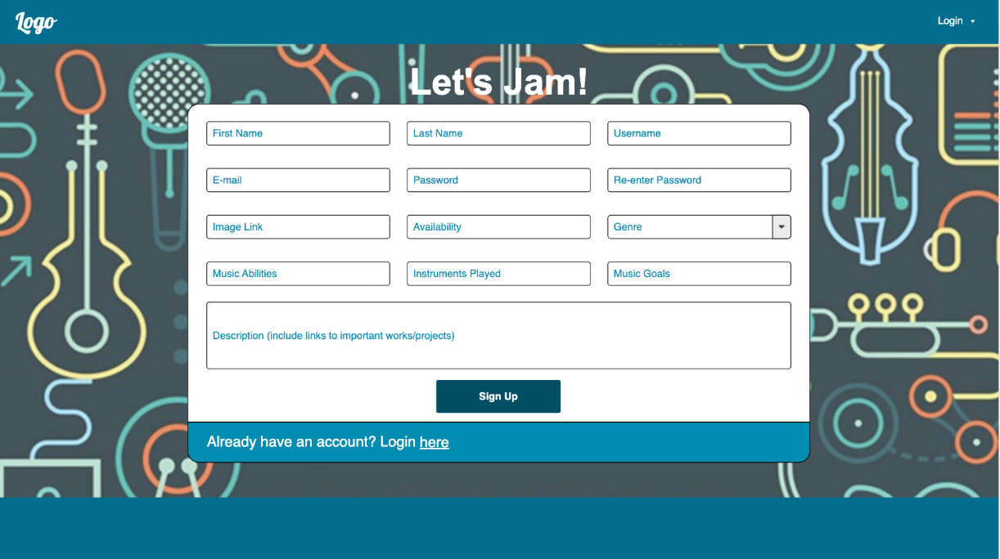
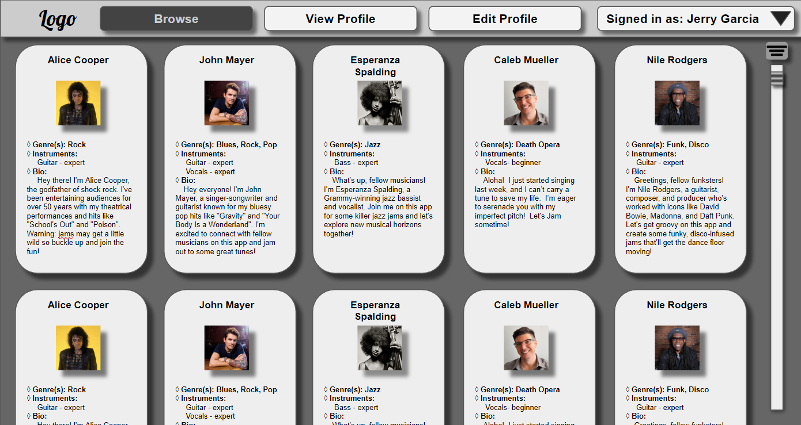
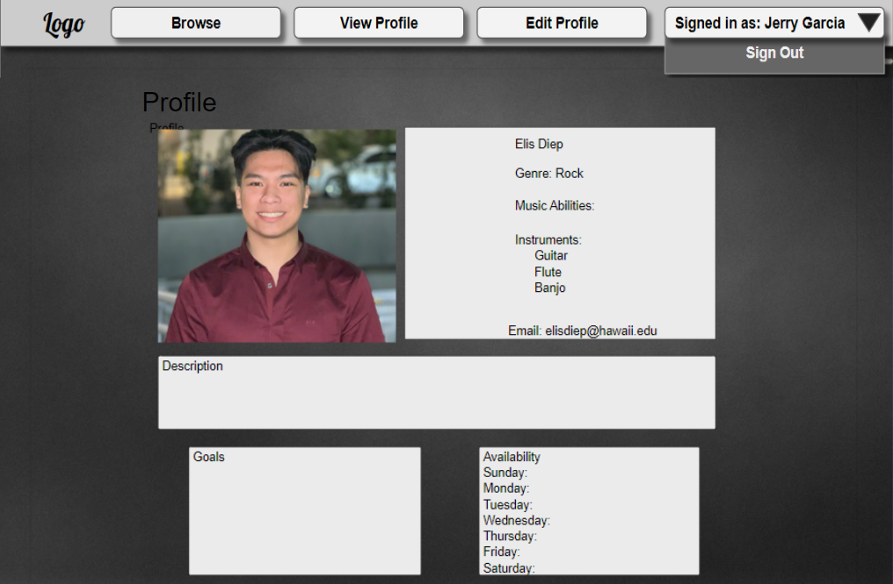

# Jamb-UH-ree

## Table of contents

* [Overview](#overview)
* [Future Plans](#future-plans)
* [Mock Ups](#mock-ups)

## Overview

Jamb-UH-ree is a hub for students at UH Manoa to find and connect with each other in order to plan jam sessions.

## Future Plans

The Jamb-UH-ree application will allow users to make an account, add information to that account, and browse/filter through a list of other accounts to find others that would like to participate in a jam session.

## Mock Ups

This section provides a mock up of the Jamb-UH-ree user interface and its capabilities.

### Landing Page

The landing page is presented to users when they visit the top-level URL to the site. Users can choose to log in or make an account.

### Sign up

This is where users can input their information to make a Jamb-UH-ree account.

### Browse Page

In the Browsing page, users can look through the list of other users to find people to jam with.

### Profile Page

In the profile page you can view more specifics about a user, or edit your own information

## Team

Jamb-UH-ree is designed, implemented, and maintained by [Jaeden Chang](https://jaedench.github.io/), [Elis Diep](https://elisdiep.github.io/), [Reid Lum](https://reidlum.github.io/), and [Caleb Mueller](https://calebmueller-uh.github.io/).
